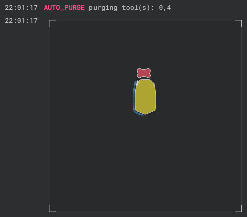
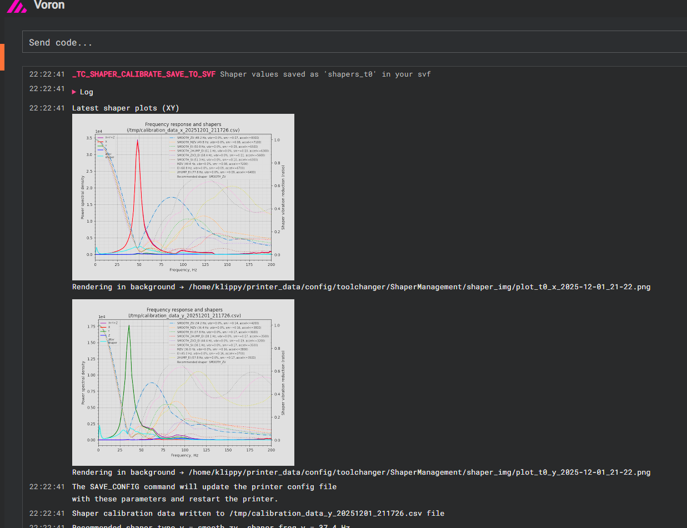

# misc macros

In here theres just macros which may or may not be related to the toolchanger, and are mostly just "nice to have"


- [Heatsoak](#interruptable_heatsoak)
- [Auto Purge](#AUTO_PURGE)
- [toolchanger shaper management](#TC_SHAPERS)


## interruptable_heatsoak

### Setup required
- rename your old `[gcode_macro PRINT_START]` -> `[gcode_macro _PRINT_START]`
- edit your heatsoak macro/copy your old one in
- make sure you have the duration in the filename, (ie: `{print_time}` in orcas filename format.)

### what it does(nt) do
- does scale based on print duration
- allows you to edit the wait time
- runs your macro at startup, allows you to do other things while the timer is running down
  (so for example, why not calibrate while we wait?)
- popup reopens a minute before it runs out, in case you wanna extend it.

### example heatsoak macro to call
```gcode
[gcode_macro HEATSOAK]
description: "my heatsoak macro"
gcode: ; Will recieve all the same parameters handed into print start to use.
    M140 S{params.BED_TEMP}
    ; move to center
    MOVE_TO_CENTER Z=5
    ; blow hot air
    M106 S255

    ; preheat all the tools
    
        M109 T{tn} S130
    
```

---

## AUTO_PURGE
more a sort of toy, but also a purge macro, analyzes your first layer, lays down lines next to the starting position, and purges tools

### setup
- add the folder to your config
- indclude auto_purge/include.cfg
- make sure you got scipy and numpy installed (you do if you have shaketune) (#TODO install dependencies)
- edit the path to point to the folder you added (`'lib_path':'~/printer_data/config/toolchanger/auto_purge'`)
- add AUTO_PURGE {rawparams} to your print start where you want to purge

### what it does

Spawns a preview SVG to console, purges your tools



### settings
theres various settings in auto_purge.cfg right at the top to adjust, such as prime line width etc, tool nozzle size yada yada is inferred from the respective extruder configs.

---

## TC_SHAPERS



All the needed knobs are right at the top of the file, nothing is however preventing you from changing anything else in here.
Macro descriptions should be pretty self explanatory.
- change show_images to False if you experience any issues
- change async to 0 to wait for the command to finish (~2 minutes)
- leave async 1 and the images will be rendered in the background and will become avalible in console/wherever they are saved once done.

before you run this you should probably edit your `save_path` of `SHOW_LATEST_SHAPER_PLOT` and perhaps configure `save_variables` if not already setup.

To load the shapers automatically youd add `TC_LOAD_SHAPERS` into the after change of your toolchanger. 

---